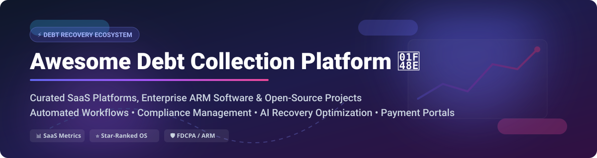

# Awesome Debt Collection Platform 💎



<p align="center">
  <a href="https://github.com/ishandutta2007/Awesome-Awesome-Awesome"></a><a href="https://discord.gg/jc4xtF58Ve"></a>
  
  
  <a href="https://github.com/ishandutta2007"></a>
</p>

## 🚀 Top Debt Collection Platforms & ARM Ecosystem

**Curated Directory of B2B SaaS Products, Enterprise ARM Systems & Open-Source GitHub Repositories**

*Focused on Debt Recovery Workflow Automation, AI Payment Negotiation, Accounts Receivable (AR) Follow-up & Compliance Management (FDCPA/GDPR).*

**Last updated: October 2026**

Welcome to the definitive awesome list of **Debt Collection Platforms**, **Accounts Receivable (AR) Management Software**, and **Debt Recovery Technology**. This repository tracks leading **SaaS platforms** and **open-source GitHub projects** designed for collection agencies, lenders, debt buyers, credit unions, and enterprise financial institutions.

---

## 📑 Table of Contents
- [📊 Market Landscape & Sizing](#-market-landscape--sizing)
- [💼 SaaS & Hosted Debt Collection Platforms](#-saas--hosted-debt-collection-platforms)
- [⚡ Open-Source GitHub Projects](#-open-source-github-projects)
- [🤝 How to Contribute](#-how-to-contribute)
- [⚖️ Disclaimer & Compliance](#️-disclaimer--compliance)
- [💖 Support & Sponsorship](#-support--sponsorship)
- [📈 Star History](#-star-history)

---

## 📊 Market Landscape & Sizing

> 💡 **Market Size & Structure**: The global debt collection software market is estimated at **$4.9B – $6.3B in 2026** (growing at a ~9.5% CAGR). The market is **moderately fragmented**, featuring legacy enterprise providers (CGI, Experian), specialized fintech automation startups (TrueAccord, Credgenics, InDebted), and a growing ecosystem of niche open-source recovery tools.

---

## 💼 SaaS & Hosted Debt Collection Platforms

The table below summarizes leading commercial SaaS and hosted debt collection platforms. Rows are sorted by **Company Size / Revenue / Funding Valuation (Descending)**.

| Platform | Description | Pricing Model & Starting Tier | Free Tier / Trial Limits | Company Size / Valuation / Revenue |
| :--- | :--- | :--- | :--- | :--- |
| **[CGI Collections](https://www.cgi.com/)** 🏢 | Enterprise collections and recovery solution offering workflow management, payment processing, and regulatory compliance. | Custom enterprise license; quote-based custom contracts (typically starts >$50,000/yr). | No free tier; demo upon request for qualified enterprise organizations. | **Enterprise Giant** ($10.5B+ annual revenue, $25B+ market cap, 90,000+ employees). |
| **[Experian Tallyman](https://www.experian.com/)** 🌍 | Enterprise collections and recovery decisioning platform with customer segmentation and debt resolution workflows. | Enterprise software license & professional services; custom annual contracts (typically >$40,000/yr). | No free tier; sandbox/demo environment available for enterprise banking clients. | **Global Financial Enterprise** ($7.1B+ annual revenue, $35B+ market cap). |
| **[Finvi](https://finvi.com/)** 🏦 | Debt collection, workflow automation, and payment portal platform for healthcare, financial services, and government (formerly Ontario Systems). | Tiered platform licensing starting from ~$1,500/month plus transactional execution fees. | No free tier; 14-day guided product demonstration and sales sandbox available. | **Market Heavyweight** ($150M+ annual revenue, backed by Aquiline Capital Partners). |
| **[Qualco](https://qualco.com/)** 📈 | Software and analytics for end-to-end credit and debt portfolio management and recovery decisioning. | Modular SaaS and enterprise licensing starting at ~$2,500/month. | No free tier; customized demo environment provided for enterprise lenders. | **Major European Leader** ($80M+ annual revenue, 500+ employees globally). |
| **[TrueAccord](https://www.trueaccord.com/)** 🤖 | Digital-first debt collection agency powered by machine learning for personalized channel recovery journeys. | Contingency-based pricing (typically 15%–35% of successfully recovered debt). | No free tier; custom trial volume pilot available for qualified enterprise creditors. | **Growth Leader** ($78M+ total funding raised, ~$22M+ estimated annual revenue). |
| **[InDebted](https://indebted.co/)** 🌐 | Intelligent omnichannel debt collection platform utilizing behavioral analytics for recovery optimization. | Contingency fee model based on recovered balance (starts at ~12%–25% contingency rate). | No free tier; 30-day pilot program offered for mid-market and enterprise accounts. | **High-Growth Fintech** ($60M+ total funding, ~$20M+ annual revenue). |
| **[Credgenics](https://credgenics.com/)** 🚀 | AI-driven debt collection and resolution platform for banks, NBFCs, and digital lenders. | Tiered SaaS subscription starting at $500/month base platform fee + usage rate per active case. | 14-day full platform free trial for registered financial institutions. | **Fintech Unicorn Candidate** ($78M+ funding, $340M+ valuation, 500+ employees). |
| **[Pair Finance](https://pairfinance.com/)** 🇩🇪 | Digital debt collection and AI behavioral dunning platform for B2C receivables. | Performance-based contingency pricing starting at ~10%–20% of recovered principal. | No free tier; pilot project option for e-commerce and fintech merchants. | **Established European Player** ($35M+ funding, ~$15M+ annual revenue). |
| **[Katabat](https://katabat.com/)** 📊 | Debt collection and customer recovery platform with predictive analytics and strategy decisioning. | Base platform fee starting at ~$1,200/month plus volume-based active account pricing. | 30-day trial environment for enterprise risk management teams. | **Mid-Market Specialist** (~$12M+ annual revenue, 100+ employees). |
| **[Collenda](https://collenda.com/)** 🛡️ | European credit management and legal debt collection software suite. | Enterprise module license starting at €1,000/month (~$1,100/mo). | No free tier; interactive online demo upon request. | **Regional Specialist** (~$15M+ annual revenue, 150+ employees). |
| **[Quantrax](https://quantrax.com/)** 🧠 | Knowledge-based automated collection and recovery software (RMEx platform) for debt agencies. | Core agency licensing starting at $850/month for up to 5 concurrent collector seats. | 30-day demo sandbox for debt collection agency operators. | **Niche Specialist** (~$8M+ annual revenue, 50+ employees). |
| **[InterProse ACE](https://interprose.com/)** ☁️ | Cloud-native debt collection software for agencies, original creditors, and government entities. | SaaS plan starting at $450/month base fee + $45/user/month. | 14-day full feature trial with sample test data loaded. | **Niche SaaS Provider** (~$6M+ annual revenue, 30+ employees). |
| **[Collect!](https://www.collect.org/)** 📁 | Flexible collection agency software for account management, payment arrangements, and reporting. | Software subscription starting at $250/month for basic single-user seat package. | 30-day free trial with full desktop/cloud access and sample database. | **Established Provider** (~$5M+ annual revenue, 30+ employees). |
| **[CollectOne](https://collectone.com/)** 📞 | Full-featured collection management software for collection agencies and credit grantors (by CDS). | Modular license starting at $300/month per active collector license. | 14-day evaluation demo for agency owners. | **Agency Software Veteran** (~$5M+ annual revenue). |
| **[Centrex](https://centrexsoftware.com/)** 💳 | Debt collection, debt settlement, and business financing CRM platform. | Starter plan at $195/month (includes 2 user seats, $65/month per extra user). | 14-day free trial with complete CRM features enabled. | **Bootstrapped SaaS** (~$3M+ annual revenue, 25+ employees). |
| **[Receeve](https://receeve.com/)** ⚡ | No-code cloud collections and recovery platform for fintechs and digital lenders. | Developer starter plan from €400/month (~$440/mo) for up to 5,000 active claims. | 14-day free sandbox access with API keys provided. | **Venture-Backed Startup** ($14M+ funding raised). |
| **[CollectAI](https://collect.ai/)** 🤖 | AI-driven digital receivables and intelligent dunning service (Aareal Bank subsidiary). | Transaction fee structure from €0.25 per digital dunning message sent. | 30-day trial pilot for enterprise B2C receivables. | **Subsidiary Entity** (Backed by Aareal Bank Group). |
| **[CollBox](https://collbox.co/)** 💼 | Automated AR and debt collection solution for small businesses integrated with QuickBooks/Xero. | Basic plan free to inspect AR; recovery network takes 15%–30% contingency on collected accounts. | Free forever tier available for AR health inspection & manual agency dispatch. | **Early Stage Startup** ($2.5M+ seed funding raised). |
| **[Paylink Solutions](https://paylinksolutions.co.uk/)** 💷 | Digital debt advice, affordability assessment, and online payment portal for creditors. | SaaS portal license starting at £350/month (~$450/mo) plus user assessment fee. | 30-day free pilot for debt advice and housing providers. | **UK Regional Leader** (~$4M+ annual revenue). |
| **[Casper365](https://casper365.com/)** 🏢 | Cloud debt collection solution built on Microsoft Dynamics 365 framework. | Licensing starting at $150/user/month (requires existing MS Dynamics tenant). | 30-day trial via Microsoft AppSource. | **Dynamics ISV Partner** (~$2M+ annual revenue). |

---

## ⚡ Open-Source GitHub Projects

Explore self-hosted, open-source debt collection, credit scoring, loan lifecycle, and AR follow-up software. Repositories below are ordered by **GitHub Stars_Count (Descending)** with direct links to stargazers.

### 🌟 Featured Open-Source Repositories

| Repository | GitHub_Stars | License | Core Functionality & Highlights |
| :--- | :--- | :--- | :--- |
| **[Apache Fineract](https://github.com/apache/fineract)** 🏛️ | [](https://github.com/apache/fineract/stargazers) | Apache-2.0 | Core banking & loan platform with delinquency tracking, collection workflow rules, late fee calculation, and charge-off management. |
| **[Frappe Lending](https://github.com/frappe/lending)** 📊 | [](https://github.com/frappe/lending/stargazers) | AGPL-3.0 | Modern open-source loan management module for ERPNext; features repayment tracking, overdue penalty calculation, and collection activity logging. |
| **[BrassLedger](https://github.com/rhamenator/BrassLedger)** 💵 | [](https://github.com/rhamenator/BrassLedger/stargazers) | GPL-3.0 | Cross-platform desktop accounting & receivables management system with customer payment application and statement dunning. |
| **[api-consulta-v2](https://github.com/acthiago/api-consulta-v2)** 🇧🇷 | [](https://github.com/acthiago/api-consulta-v2/stargazers) | MIT | Brazilian debt querying and automated boleto management API; features CPF queries, multi-debt installment calculation, fines, and interest rules. |
| **[Darj Smart Collection](https://github.com/mym1359/darj-smart-collection)** 🧠 | [](https://github.com/mym1359/darj-smart-collection/stargazers) | MIT | Machine learning debt collection decision system using XGBoost behavioral models to recommend optimal recovery actions (calls, warnings, legal). |
| **[Orvaket](https://github.com/Akam1123/orvaket)** 🔐 | [](https://github.com/Akam1123/orvaket/stargazers) | MIT | Local-first accounts receivable follow-up workspace; imports QuickBooks/Xero CSV exports, generates email follow-ups with local AES-256 encryption. |
| **[Préstamos Gota a Gota](https://github.com/ChrithianC5Develop/prestamos-gota-a-gota)** 📱 | [](https://github.com/ChrithianC5Develop/prestamos-gota-a-gota/stargazers) | MIT | Loan lifecycle and daily collection management system built with FastAPI & Kotlin Multiplatform; includes collector field routing and mobile schedules. |
| **[FSSP-Tracker](https://github.com/Serx17/fsps-tracker-mvp)** ⚖️ | [](https://github.com/Serx17/fsps-tracker-mvp/stargazers) | MIT | Enforcement proceedings tracking system for legal debt recovery; integrates with Bitrix24/AmoCRM webhooks for legal status checks. |
| **[NADI (wahfix)](https://packagist.org/packages/wahfix/nadi)** 🐘 | [](https://packagist.org/packages/wahfix/nadi) | MIT | Laravel package for loan collections and payment waterfall allocation (fines → interest → principal) with 11-state loan lifecycle. |
| **[GT-DAYN](https://discourse.aosus.org/t/topic/5277/5)** 🌐 | [](https://discourse.aosus.org/t/topic/5277/5) | GPL-3.0 | Arabic privacy-focused PWA offline debt & expense tracker; handles personal IOUs, installment schedules, and multi-currency balances. |
| **[OpenAR Collective](https://www.opensourceforu.com/2026/08/openar-collective-foundation-debut/)** 🏛️ | *(Upcoming)* | Apache-2.0 | Non-profit foundation initiative building a vendor-neutral, Apache-licensed enterprise ARM platform foundation. |

---

## 🛠️ Recommended Tech Stack for Custom Debt Platforms

To build a enterprise-grade custom debt collection platform, combine these open-source modules:

```
+-------------------------------------------------------------------+
|                        PRESENTATION LAYER                         |
|  • Orvaket Workspace (Local-First AR Dashboard)                   |
|  • Préstamos Gota a Gota Mobile App (Field Collector Route)       |
+-------------------------------------------------------------------+
                                  |
                                  v
+-------------------------------------------------------------------+
|                         DECISION ENGINE                           |
|  • Darj Smart Collection (XGBoost Behavioral Action Predictor)    |
|  • FSSP Tracker (Legal Enforcement Status & Webhooks)             |
+-------------------------------------------------------------------+
                                  |
                                  v
+-------------------------------------------------------------------+
|                     CORE ACCOUNTING & LEDGER                      |
|  • Apache Fineract / Frappe Lending (Loan Lifecycle & Penalty)    |
|  • NADI Laravel Engine (Payment Allocation Waterfall)             |
|  • BrassLedger (Receivables Cash Application & Month-End)         |
+-------------------------------------------------------------------+
```

---

## 🤝 How to Contribute

We welcome contributions from collection professionals, software engineers, and fintech enthusiasts!

1. **Fork** this repository.
2. **Create a feature branch**: `git checkout -b add-new-platform`
3. **Add entry** to `README.md` keeping formatting consistent.
4. **Open a Pull Request** with a brief summary of the software added.

---

## ⚖️ Disclaimer & Compliance

- This repository is a **community-curated index** and does not constitute financial, legal, or investment advice.
- Debt collection platforms process sensitive financial data. Operators must ensure full compliance with regulatory frameworks including **FDCPA** (US), **TCPA** (US), **GDPR** (EU), **CFPB guidelines**, and regional debt recovery laws.

---

## 💖 Support & Sponsorship

If you found this curated list helpful for your research, debt recovery operations, or software engineering project, please consider supporting the project!

- 🌟 **Star** this repository on GitHub
- 🔀 **Fork** and share with your colleagues & network
- ☕ **Sponsor the Maintainer**: [Buy me a coffee on GitHub Sponsors](https://github.sponsors/ishandutta2007)

Thank you for supporting open financial software reference lists!

---

## 📈 Star History

[](https://star-history.dera.page/#ishandutta2007/Awesome-Debt-Collection-Platform&type=date&legend=top-left)
